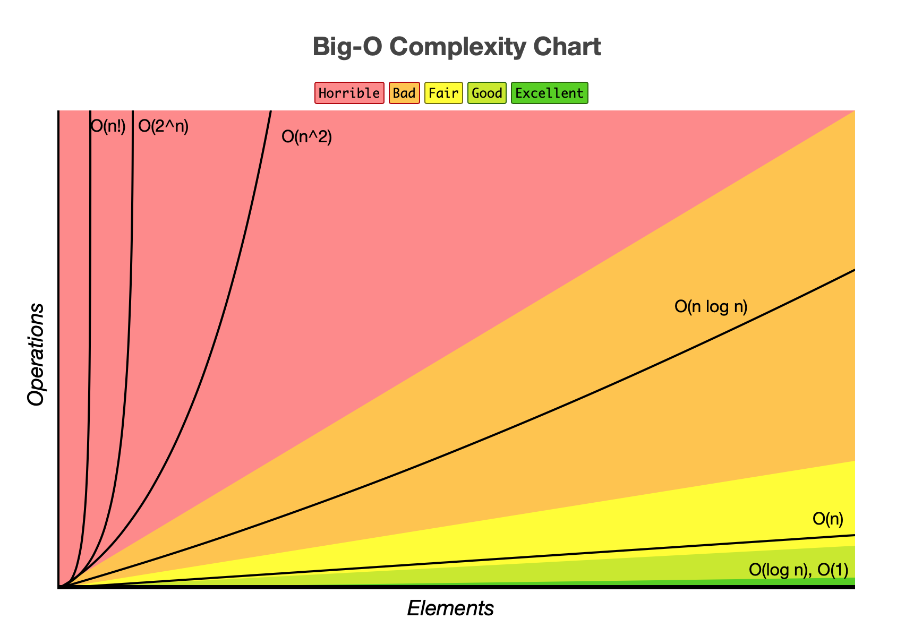

# 算法

## 基础概念

### 复杂度
- 时间复杂度
    - 运行一个算法需要多长时间 它和执行每条语句的耗时以及每条语句的执行频率有关 大O表示法 表示时间复杂度
- 空间复杂度
    - 万物都有容量，而应用程序的容器就是内存，内存暂用率越高，程序越容易崩溃。
### 常用的复杂度级别
- 多项式阶:
    - 随着数据规模的增长，算法的执行时间和空间占用，按照多项式的比例增长，包括，O(1)(常数阶)、O(logn)(对数阶)、O(n)(线性阶)、O(nlogn)(线性对数阶)、O(n^2)(平方阶)、O(n^3)(立方阶)、 .... (k方阶)、 O(2^n)(指数阶) 。

    
- 非多项式阶:
    - 随着数据规模的增长，算法的执行时间和空间占用暴增，这列算法性能极差。包括，O(2^n)(指数阶)、O(n!)(阶乘阶)。
### 复杂度分析的四个概念
- 最坏情况时间复杂度：代码在最坏情况下执行的时间复杂度。
- 最好情况时间复杂度：代码在最理想情况下执行的时间复杂度。
- 平均时间复杂度：用代码在所有情况下执行的次数的加权平均值表示。
- 均摊时间复杂度：在代码执行的所有复杂度情况中绝大部分是低级别的复杂度，个别情况是高级别复杂度且发生具有时序关系时，可以将个别高级别复杂度均摊到低级别复杂度上。基本上均摊结果就等于低级别复杂度。
> 一般情况下，我们看一个算法的好坏，是看平均复杂度和最坏复杂度。一个算法在最坏的时间复杂度里也能有很好的性能，也代表了这个算法的可靠程度。

### 稳定排序和不稳定排序
- 如果队列中存在两个相等的数字排序过程中 这两个数字的先后顺序如果不会发生变化 就叫做稳定的排序反之叫做不稳定

### 案例

1. 如何在数组的中间添加数组
```js
function avaerageAdd() {
    let nums = [1, 2, 3, 4, 5, 6, 7, 8]
    const newArr = [233, 666]
    nums.splice.apply(nums, [Math.floor(nums.length/2), 0].concat(newArr))
    return nums
}
// [1, 2, 3, 4, 233, 666, 5, 6, 7, 8]
```

2. 判断给定字符串是否回文 (以某个字符为中心的前缀和后缀都是相同的) '1234321' 'abcbc'
```js
function isPlalindrome (word) {
    let s = []
    Array.prototype.forEach.call(word, item => {
        s.push(item)
    })
    let rword = ''
    while(s.length > 0) {
        rword += s.pop()
    }
    return (word === rword)
}

function isPlalindrome0 (word) {
    let tempArr = word.split('')
    return (tempArr.join('') === tempArr.reverse().join(''))
}

```

3. 二分搜索: 二分查找的前提是数组一开始就是有序的
```js

```

4. 冒泡排序
```js
// 冒泡排序的时间复杂度是 O(n^2) [平方阶],因为它是双重循环 而且是稳定排序
function bubbleSort (arr) {
    arr.forEach((item, index) => {
        for (let i = 0; i < arr.length - index; i ++) {
            if (arr[i] > arr[i + 1]) { // 根据这里判断是稳定排序
                // 使用解构赋值 实现两个变量互换
                [ arr[i], arr[i+1] ] = [ arr[i + 1], arr[i] ]
            }
        }
    })
    console.log(arr)
}
bubbleSort([1,4,2,6])
```

5. 快速排序: 快排就是一开始找个中介，然后把比它小的放左边，比它大的放右边，然后重新对中介两边的数据各自重新找个中介,如此循环。
```js
// 快排的时间复杂度是O(nlogn) [线性对数阶]，属于不稳定的排序
function quickSort (arr) {
    if (arr.length <= 1) return arr // 递归的结束条件
    
    let pivotIndex = Math.floor(arr.length / 2)
    let pivot = arr.splice(pivotIndex, 1)[0] // 在数组中取出中间值
    let left = []
    let right = []
    arr.forEach (item => {
        if (item < pivot) {
            left.push(item)
        } else {
            right.push(item)
        }
    })
    return quickSort(left).concat(pivot, quickSort(right))
}

bubbleSort([1,4,2,100,4,6,7])
```
6. 选择排序: 找到数组中最小的那个元素，将它和数组的第一个元素交换位置; 在剩下的数组中找到最小的元素，将它和数组的第二个元素交换; .....
```js
// 选择排序的时间复杂度是O(n^2) [平方阶] 不稳定排序
function selectSort (arr) {
    arr.forEach((item, index) => {
        let min = arr[index]
        for(let i = 1; i < arr.length; i ++) {
            if (min > arr[i]) {
                min = arr[i]
            }
        }
        arr[index] = min
    })
    return arr
}
console.log(quickSort([1,4,900,2,100,4,6,7]))
```
7. 插入排序: 插入排序它将数组分成“已排序”和“未排序”两部分，一开始的时候，“已排序”的部分只有一个元素，然后将它后面一个元素从“未排序”部分插入“已排序”部分，从而“已排序”部分增加一个元素，“未排序”部分减少一个元素。以此类推，完成全部排序。(优化版的冒泡排序)
```js
// 插入排序的时间复杂度是O(n^2) [平方阶] 稳定排序
function insertSort (arr) {
    for ( let i = 0; i <= arr.length; i ++) {
        for (let j = i; j > 0 && arr[j] < arr[j-1]; j--) { // 每次循环都从 排好序部分最大的开始
            [arr[j-1], arr[j]] = [arr[j], arr[j-1]]
        }
    }
    return arr
}
console.log(insertSort(arr))

```

8. 希尔排序: 希尔排序属于高级排序，因为它其实是利用了多个插入排序来实现。<br/>先将整个待排序的记录序列分割成为若干子序列分别进行直接插入排序，待整个序列中的记录“基本有序”时，再对全体记录进行一次直接插入排序
```js
// 希尔排序 属于不稳定的排序，时间复杂度为O(nlog^2*n)
function shellSort (arr) {
    let h = 1
    while (h< arr.length / 3) {
        h = 3 * h + 1
    }
    while (h >= 1) {
        for (let i = h; i < arr.length; i++) {
            for (let j = i; j>= h && arr[j] < arr[j-h]; j -=h) {
                [arr[j-h], arr[j]] = [arr[j], arr[j-h]]
            }
        }
        h = --h/3
    }
    return arr
}
console.log(shellSort(arr))

```

9. 归并排序: 归并算法的原理是将所有元素拆成相邻的一对一对的,然后两两排序,再将相邻的一对元素再合并排序,四个四个排序,如此循环最后只剩两组大的已经排好序的数组再合并一起排序。
```js

```

10. 睡眠排序
```js
    let arr = [1, 3, 2, 2.5, 5, 23, 77, 4, 300, 400, 88]

    function sleepSort(arr) {
        let result = []
        arr.forEach((item) => {
            setTimeout(() => {
                result.push(item)
                if (result.length == arr.length) { // 结果数组和原数组length 相等时 排序完成
                    console.log(result)
                }
            }, item);
        })
    }

    sleepSort(arr)
```
