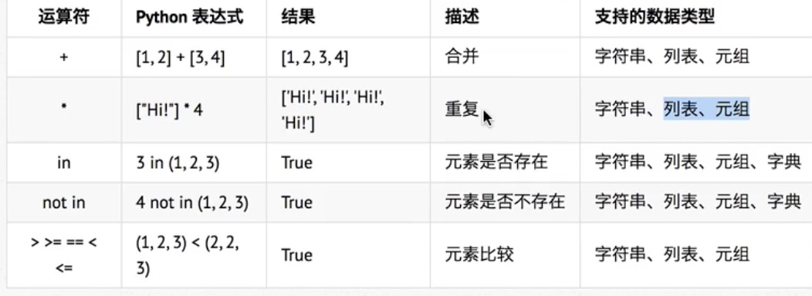

# Python
## 人生苦短  我用Python

## 科普
- 解释型语言  需要解释器
    - 逐行解释 源代码 跨平台更好
- 编译型语言  需要编译器
    - 统一编译后 再执行 速度更快 如 c c++

## Python 的设计目标
- 简单 直观 
- 开源
- 代码像纯英语那样容易理解
- 适合短期开发日常任务

## Python 的设计哲学
- 优雅
- 明确
- 简单
- 开发哲学: 用一种方法,最好是只用一种方法来做一件事
- 如果面临多种选择, Python 开发者一般会拒绝花俏的语法 而选择明确没有或者很少有歧义的语法

## 为什么选择Python
- 代码量少 Python : Java = 1 : 5 人生苦短 我用 Python

## Python 特点
- Python是完全面向对象的语言
    - 面向对象是一个思维方式 也是一门程序设计技术 要解决一个问题前 首先考虑 由谁 来做 怎么做事情是 谁 的职责最后把事情做好就行
    - 对象 就是 谁
    - 要解决复杂的问题 就可以找多个不同的对象 各司其职 共同实现 最终完成需求
- Python 拥有强大的标准库 Python 语言的核心只包括 数字 字符串 列表 字典 文件等常见类型和函数 而标准库 提供了 系统管理 网络通信 文本处理 数据库接口 等额外的功能
- Python 社区提供大量的第三方模块 涵盖 科学计算 人工智能 机器学习 web开发 数据库接口

## Python 的优缺点
- 优点
    - 简单 易学
    - 免费 开源
    - 面向对象
    - 丰富的库
    - 可拓展性
        - 如果需要一段关键的代码运行的更快或者希望某些算法不公开 可以把这部分代码有 c c++ 编写 然后在 Python 程序中使用他们
- 缺点
    - 运行速度 解释性语言
    - 国内市场较小
    - 中文资料困乏

## 第一个 Python 
- 每一个程序员都是子啊不断的修改错误中成长的

## 运行Python的三种方式
- 交互式 适合验证语法等简单的操作
    - 直接在终端输入 python3  exit()或者 ctrl + D 退出

## 安装 Pycharm IDE
- 第一次启动  不用导入配置文件  选第二项 ok 下一步
- 许可证激活  选 free 30days
- 设置配色 --> ok
- 设置项目的解释器版本
    - file--> setting --> Project --> 到自己项目 --> Prject Interpreter -- ok

## Python 中的注释
- 单行注释  # 
- 多行注释 块注释 三个引号
```
"""
我就是多行注释开始----
我就是多行注释
我就是多行注释
我就是多行注释
我就是多行注释
我就是多行注释结束----
"""
```

## 关于Python 的代码规范
- Python 官方提供有一系列 PEP (Python Enhancement Proposals) 文档
- 其中第八篇文档 专门针对Ptyhon 的代码格式 给出了建议 也就是俗称的 PEP8
- 文档地址: https://www.python.org/dev/peps/pep-0008/
- 谷歌中文: https://zh-google-styleguide.readthedocs.io/en/latest/google-python-styleguide/python_style_rules/
> 任何语言的程序员 编写出符合规范的代码 是开始程序生涯的第一步

## Python 中的算术运算符
- \+ 
- \-
- \*
- \/
- \// 取整除 eg. 9 // 2 = 4
- %  取余
- \** 幂 2 ** 3 = 8
- "-" * 10 = "----------" 用于字符串的乘

## 算数运算符的优先级
- 先乘除 后加减
- 同级运算符是从左至右 计算
- 可以使用 () 调整优先级

|运算符|描述|
|----|----|
| 幂 | 优先级最高|
|  乘 除 取余 取整除| 优先级其次|
| 加 减 | 优先级最低|

## Python 变量的基本使用
- 变量名 = 值
    ```

    qq_number = "123"
    print(qq_number)

    ```
- 变量的类型 声明时不需要指定类型
    ```
    // str
    name = "小明"

    // int 整型
    age = 18

    // boolean  注意大写
    gender = True 

    // float  浮点数
    height = 1.75

    ```
- type函数检查变量类型   type(name)

## input 函数 实现 键盘输入
```

password = input("请输入您的银行密码")
type(password)

```
## 类型转换函数
 ```
 int(x) // 将x转换为int
 float('123')  // 123.0
 ```

 ## 格式化输出
 ```
 // 表示字符串
name = "小明"
print("我的名字叫 %s, 请多多关照" %name)

// 表示数字
student_no = 100 
print("我的学号是 %06d" % student_no) // 000100 不够 6位 会补零

// 表示浮点数 可控制精度
price = 8.5
weight = 7.5
num = price * weight
print("苹果的价格是 %.2f, 重量是%.3f , 您要支付的价格是%.4f" % (price, weight, num))  // 苹果的价格是 8.50, 重量是7.500 , 您要支付的价格是63.750

// 输出 % 需要 %%
price = 85
print("%.2f%%" %(price / 100)) // 8.50%

 ```

 ## 变量的命名
 - 标识符 可以由 字母 下划线 数字 组成
 - 不能用数字开头
 - 不能喝关键字重名

 ## 关键字
 - import 关键字 就可以导入一个包
    ```
    import keyword 
    print (keyword.kwlist) 

    """
    ['False', 'None', 'True', 'and', 'as', 'assert', 'async', 'await', 'break', 'class', 'continue', 'def', 'del', 'elif', 'else', 'except', 'finally', 'for', 'from', 'global', 'if', 'import', 'in', 'is', 'lambda', 'nonlocal', 'not', 'or', 'pass', 'raise', 'return', 'try', 'while', 'with', 'yield']
    """

    ```

## 变量命名规则
- 标识符是区分大小写的
- 使用短横线连接 first_name last_name qq_number

## if 语句 通过缩进控制 注意 关键字后的: 
```
age = 15 
if age >= 18:
    print("我已经18岁了")
elif age > 27:
    print("哈哈)
else:
    print("我是else")
print("我永远会执行")

```

## 逻辑运算符 and or not取反

## if 语句的嵌套  注意 缩进就行

## 循环 while
```
count = 0 
while const < 5:
    print(const)
    const = const + 1
else:
    print(const)
```
## break 和 continue
- break 是跳出整个循环
- continue 跳出本次循环

## 函数基础
```
def 函数名():
    封装函数的代码
    """
```
- def 是 define 的缩写
- 函数名称 应该能表达 函数封装代码 的功能 方便后续的调用
- 函数名称 的命名应该符合 标识符的命名规则
```

def say_hello ():
    """打招呼""
    print(123)

say_hello()

```

## 模块
- 模块就是一个 工具包 import 导入就可以使用
- 每一个以py结尾的文件 都是一个模块
- 在模块中定义的 全局变量 函数 都是模块能够提供给外界直接使用的工具
- 模块名 就是文件名

## list 列表
- 列表定义
```

list = [1,2,3,'James','Paul']

list = [i for i in range(10)]

```
- 添加元素
    - list.append() ：尾部新增元素

    ```
    　　>>> list = [1,2,3]
    　　>>> list.append(5)
    　　>>> list
    　　[1, 2, 3, 5]
    ```
    - list.insert()：插入元素  list.insert(index, object)  参数一：index 位置， 参数二：object
    ```
        

    　　>>> list = [1,2,3,5]
    　　>>> list.insert(3,4)
    　　>>> list
    　　[1, 2, 3, 4, 5]
    ```
    - list.extend() : 扩展列表 list.extend(tablelist)，左右与 + 类似
    ```
        >>> list1 = [1,2,3]
        >>> list2 = ['a','b']
        >>> list1.extend(list2)
        >>> list1
    　　[1, 2, 3, 'a', 'b']
    ```
    - \+ 号用于组合列表
    ```
        >>> L1 = [1,2,3]
        >>> L2 = ['a', 'b']
        >>> L1+L2
        [1, 2, 3, 'a', 'b']
    ```
    - \* 号用于重复
    ```
        >>> L1 = [1, 2, 3]
        >>> L1 * 3
        >>> L1
        [1, 2, 3, 1, 2, 3, 1, 2, 3]
    ```
- 访问\修改列表元素
```
    >>> a = ['a',5,'z']
    >>> a[2]
    'z'

    元素重新赋值：=

    >>>a[2] = 'LL'

    >>>a

    ['a',5,‘LL’]
```
[list方法](https://www.cnblogs.com/xioawu-blog/p/11044385.html)

- list 的遍历
```
name_list = ["小明", "小花", "小刚"]
for name in name_list:
    print("我的名字叫 %s" %name)
```

## 元组
- 定义 () 索引从 0 开始 定义后不能修改
```
info_tuple = ("zhangsan", 18, 1.75)
```
- 创建空元组 
```
tuple = ()
```
- 元组只包含一个元素是 元素末尾要加 ,
```
info_tuple = (50,)
```
- 常用操作
    - del info_tuple 删除整个元组
    - len(info_tuple) // 获取长度
    - info_tuple.index(50) // 获取下标
    - for 循环
- 应用场景
    - 作为函数的饿参数 或者 返回值 一个函数可以接收任意多个参数 或一次返回多个数据
    - 格式字符串 格式化字符串后面的饿 () 实质就是一个元组
    - 保护列表的数据安全

## 字典

## 字符串的定义
- 在Python中 "" 或者 '' 定义字符串
- 支持单引 双引 的嵌套
- 常用操作
    - 

## 公共方法
- Python 的内置函数
    - len() 长度
    - del(item) 删除
    - max() 返回容器的最大值
    - min() 返回容器的最小值  注意比较字典时 比较的是的 key
    - cmp(item0, item1) 比较两个值
- 注意: 字符串比较 "0" < "A" < "Z" < "a" < "z"
- 切片 字符串 列表 元组支持  字典不支持 因为字典无序
    - "012345"[0:3] // 012 
- 运算符



 


